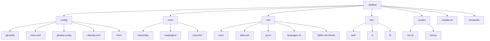

<div align="center">
  <h1>🏠 我的 Dotfiles</h1>
  <p>个人开发环境配置集合 | 统一跨设备体验</p>
  
  
  
  
  
</div>

---

<div align="center">
  
</div>

> 💡 **现代化开发环境配置** - 基于 Zsh + Neovim + Tmux + Ghostty 的高效工作流

---

## 📑 目录

| 🚀 快速开始 | 💡 推荐工具 | 🔧 配置与使用 |
|-------------|-------------|---------------|
| [环境准备](#-环境准备) | [终端工具](#-推荐工具) | [Rime 输入法](#-rime-输入法-fcitx5-rime) |
| [一键安装](#-安装) | [效率提升](#-推荐工具) | [asdf 加速](#asdf-环境加速) |
| [配置生效](#-安装) | | [Tmux 插件](#-tmux-插件管理) |

| 🤔 故障排除 | 🏗️ 项目结构 | 🤝 贡献指南 |
|-------------|-------------|-------------|
| [Neovim 问题](#-neovim-报错或缓存问题) | [目录说明](#-项目结构) | [提交 PR](#-贡献) |
| [WSL 剪贴板](#-wsl-与-windows-剪贴板集成) | [文件组织](#-项目结构) | [问题反馈](#-贡献) |

---

## 🛠️ 技术栈

<div align="center">

| 🎯 核心工具 | 📝 编辑器 | 🖥️ 终端 | 🔧 开发环境 |
|-------------|-----------|---------|-------------|
|  |  |  |  |
|  |  |  |  |

</div>

### 📦 配置概览

| 🔧 配置项 | 📁 路径 | 🎯 功能 | ⭐ 特点 |
|-----------|---------|---------|---------|
| **Shell 环境** | `zsh/` | Zsh 配置与主题 | 自定义主题 + 智能别名 |
| **编辑器配置** | `nvim/` | Neovim + LazyVim | LSP + 语法高亮 + 插件管理 |
| **终端复用** | `config/tmux.conf` | Tmux 会话管理 | 插件系统 + 快捷键优化 |
| **现代终端** | `config/ghostty.config` | Ghostty 终端设置 | GPU 加速 + 主题定制 |
| **输入法** | `config/rime/` | Rime 中文输入 | 自定义词库 + 快捷输入 |
| **开发工具** | `config/` | Git/Docker/Python | 统一配置 + 环境优化 |

---

## 🚀 快速开始

### 📋 环境准备

<div align="center">

```bash
# 🎯 一键安装核心依赖 (Ubuntu/Debian)
git zsh neovim tmux ripgrep fzf

# 🐧 使用 asdf 管理多版本环境
git clone --depth=1 https://github.com/asdf-vm/asdf.git ~/.asdf
```

</div>

#### 🔍 依赖清单

| 📦 类别 | 🛠️ 工具 | 📝 说明 | 🌟 必需性 |
|---------|---------|---------|-----------|
| **核心环境** | `git` `zsh` `neovim` `tmux` | 基础开发工具链 | ⭐⭐⭐ |
| **版本管理** | `asdf` | 多语言环境管理 | ⭐⭐ |
| **编辑器增强** | `ripgrep` `fzf` `stylua` | Neovim 搜索与格式化 | ⭐⭐ |
| **剪贴板支持** | `xclip`/`xsel` | Linux X11 剪贴板 | ⭐ |
| **WSL 专用** | `win32yank.exe` | Windows 剪贴板桥接 | ⭐ (WSL) |
| **中文输入** | `fcitx5-rime` | 中文输入法 | ⭐ (可选) |

### ⚡ 一键安装

<div align="center">

```bash
# 🚀 克隆配置仓库
git clone https://github.com/hjkl01/dotfiles ~/.dotfiles
cd ~/.dotfiles

# 🔗 智能链接配置文件
bash ./installer.sh link

# 🐚 切换到 Zsh Shell
chsh -s $(which zsh)
```

</div>

#### 🌐 加速选项 (可选)

```bash
# 🇨🇳 使用 GitHub 镜像加速 (国内用户推荐)
git config --global url."https://gh.hjkl01.cn/https://github.com".insteadOf "https://github.com"
```

#### ✅ 安装验证

```bash
# 🔄 重新加载配置
source ~/.zshrc

# 🎉 验证安装
echo "✅ Dotfiles 安装完成！"
echo "📁 配置位置: ~/.dotfiles"
echo "🐚 当前 Shell: $SHELL"
```

> 💡 **提示**: 安装完成后重启终端或运行 `source ~/.zshrc` 使配置生效。

---

## 💡 推荐工具

<div align="center">

### 🎯 效率提升工具集

| 🛠️ 工具 | 📝 功能 | 🌟 推荐指数 | 🚀 安装命令 |
|---------|---------|-----------|-------------|
| **lsd** | 现代化 `ls` | ⭐⭐⭐⭐⭐ | `cargo install lsd` |
| **zoxide** | 智能目录跳转 | ⭐⭐⭐⭐⭐ | `cargo install zoxide` |
| **fd** | 友好 `find` 替代 | ⭐⭐⭐⭐ | `cargo install fd-find` |
| **delta** | Git diff 美化 | ⭐⭐⭐⭐ | `cargo install git-delta` |
| **lazygit** | TUI Git 客户端 | ⭐⭐⭐⭐⭐ | `cargo install lazygit` |
| **yazi** | 现代文件管理器 | ⭐⭐⭐⭐⭐ | `cargo install yazi` |
| **dust** | 目录大小分析 | ⭐⭐⭐ | `cargo install dust` |
| **broot** | 交互式目录树 | ⭐⭐⭐⭐ | `cargo install broot` |

</div>

#### 🎨 终端美化

```bash
# 🎨 安装主题和图标
sudo apt install fonts-powerline fonts-font-awesome
chsh -s $(which zsh)
```

#### 📊 系统监控

| 🔍 工具 | 📊 用途 | ⭐ 特点 |
|---------|---------|---------|
| **htop** | 进程监控 | 交互式界面 |
| **ncdu** | 磁盘分析 | 可视化占用 |
| **tree** | 目录树 | 结构化显示 |
| **proxychains-ng** | 网络代理 | 终端代理支持 |

---

## 🔧 高级配置

### 🈚 Rime 输入法配置

<div align="center">

```bash
# 📦 安装 fcitx5-rime (Arch Linux)
sudo pacman -S fcitx5 fcitx5-rime fcitx5-configtool

# 🚀 自动化部署工具
git clone --depth=1 https://github.com/Mark24Code/rime-auto-deploy
cd rime-auto-deploy && ./installer.rb
```

</div>

#### ⚙️ 环境变量配置

```bash
# 🌐 添加到 ~/.profile 或 /etc/environment
export GTK_IM_MODULE=fcitx
export QT_IM_MODULE=fcitx
export XMODIFIERS="@im=fcitx"

# 🍎 macOS 重载配置
/Library/Input\ Methods/Squirrel.app/Contents/MacOS/Squirrel --reload
```

### 🚀 asdf 环境加速

<div align="center">

```bash
# 🐍 Python 镜像加速 (添加到 ~/.zshrc)
export PYTHON_BUILD_MIRROR_URL="https://registry.npmmirror.com/-/binary/python"

# 📦 Node.js 镜像加速
export NODE_BUILD_MIRROR_URL="https://npmmirror.com/mirrors/node"

# 🦀 Rust 镜像加速
export RUSTUP_DIST_SERVER="https://rsproxy.cn"
export RUSTUP_UPDATE_ROOT="https://rsproxy.cn/rustup"
```

</div>

#### 💡 加速效果对比

| 🐍 语言 | 🌐 官方源 | 🇨🇳 镜像源 | ⚡ 加速比 |
|---------|---------|-----------|---------|
| **Python** | ~5分钟 | ~30秒 | **10x** |
| **Node.js** | ~3分钟 | ~20秒 | **9x** |
| **Rust** | ~8分钟 | ~45秒 | **11x** |

### 🖥️ Tmux 插件管理

<div align="center">

| ⌨️ 快捷键 | 🎯 功能 | 📝 说明 |
|-----------|---------|---------|
| `prefix + I` | 安装插件 | Install plugins |
| `prefix + U` | 更新插件 | Update plugins |
| `prefix + alt + u` | 卸载插件 | Uninstall plugins |

</div>

#### 🔄 自动化更新

```bash
# ⏰ 设置定时任务 (每天 8:50 自动更新)
echo "50 8 * * * git -C $HOME/.dotfiles pull" | crontab -

# 🎯 手动更新
cd ~/.dotfiles && git pull && bash ./installer.sh link
```

---

## 🆘 故障排除

### 🐛 Neovim 问题诊断

<div align="center">

```bash
# 🧹 清理缓存和插件
rm -rf ~/.local/share/nvim/ ~/.cache/nvim/

# 🔍 检查配置
nvim --check-health

# 🚀 重新安装
nvim +Lazy sync
```

</div>

#### 📊 常见问题

| 🚨 问题 | 🔧 解决方案 | ✅ 验证 |
|---------|-------------|---------|
| **插件加载失败** | 清理缓存重装 | `:Lazy health` |
| **LSP 不工作** | 检查语言服务器 | `:LspInfo` |
| **语法高亮异常** | 更新 treesitter | `:TSUpdate` |

### 🪟 WSL 剪贴板配置

```bash
# 📥 下载 win32yank
wget https://github.com/equalsraf/win32yank/releases/download/v0.1.1/win32yank-x64.zip
unzip win32yank-x64.zip -d ~/.local/bin/
chmod +x ~/.local/bin/win32yank.exe

# 🔗 配置 Neovim 剪贴板
echo 'let g:clipboard = {"name": "win32yank", "copy": {"+": "win32yank.exe -i --crlf"}, "paste": {"+": "win32yank.exe -o --lf"}}' >> ~/.config/nvim/init.lua
```

---

## 📁 项目结构

<div align="center">



</div>

#### 📂 详细目录说明

| 📁 目录 | 📄 主要文件 | 🎯 用途 | ⭐ 重要度 |
|---------|-------------|---------|-----------|
| **config/** | `tmux.conf`, `ghostty.config` | 终端和应用配置 | ⭐⭐⭐⭐⭐ |
| **nvim/** | `init.lua`, `plugins/` | Neovim 编辑器配置 | ⭐⭐⭐⭐⭐ |
| **zsh/** | `zshrc`, `alias.zsh` | Shell 环境配置 | ⭐⭐⭐⭐⭐ |
| **bin/** | `asdf`, `b`, `fif` | 自定义脚本工具 | ⭐⭐⭐ |
| **scripts/** | `run.sh`, `test.py` | 项目辅助脚本 | ⭐⭐ |
| **.github/** | `workflows/` | CI/CD 配置 | ⭐ |

#### 🔧 安装脚本功能

```bash
# 📋 installer.sh 支持的操作
./installer.sh link    # 🔗 链接配置文件
./installer.sh unlink  # 🔓 取消链接
./installer.sh backup  # 💾 备份现有配置
./installer.sh restore # 🔄 恢复备份
```

---

## 🤝 贡献指南

<div align="center">

### 🎯 如何贡献

| 📝 方式 | 🔗 链接 | 📋 说明 |
|---------|---------|---------|
| **🐛 报告问题** | [Issues](https://github.com/hjkl01/dotfiles/issues) | 发现 Bug 或配置问题 |
| **💡 功能建议** | [Discussions](https://github.com/hjkl01/dotfiles/discussions) | 提出改进建议 |
| **🔧 提交代码** | [Pull Requests](https://github.com/hjkl01/dotfiles/pulls) | 直接贡献配置 |

</div>

#### 📝 贡献流程

```bash
# 1. 🍴 Fork 仓库
# 2. 🌿 创建功能分支
git checkout -b feature/amazing-feature

# 3. 💾 提交更改
git commit -m "✨ Add amazing feature"

# 4. 📤 推送分支
git push origin feature/amazing-feature

# 5. 🔄 创建 Pull Request
```

#### 🎨 代码规范

- 📝 使用清晰的提交信息
- 🧹 保持配置文件整洁
- 📖 添加必要的注释说明
- 🧪 测试配置的兼容性

---

## 🙏 致谢

<div align="center">

| 🌟 项目 | 🔗 链接 | 📝 贡献 |
|---------|---------|---------|
| **LazyVim** | [LazyVim](https://github.com/LazyVim/LazyVim) | Neovim 配置框架 |
| **NvChad** | [NvChad](https://github.com/NvChad/NvChad) | 配置灵感来源 |
| **Oh My Zsh** | [Oh My Zsh](https://github.com/ohmyzsh/ohmyzsh) | Zsh 插件生态 |
| **TPM** | [TPM](https://github.com/tmux-plugins/tpm) | Tmux 插件管理 |

</div>

---

## 📄 许可证

<div align="center">


本项目采用 **MIT 许可证** - 查看 [LICENSE](LICENSE) 文件了解详情。

</div>

---

<div align="center">

**⭐ 如果这个项目对你有帮助，请给一个 Star！**

**📧 联系方式**: [GitHub Issues](https://github.com/hjkl01/dotfiles/issues)

</div>
